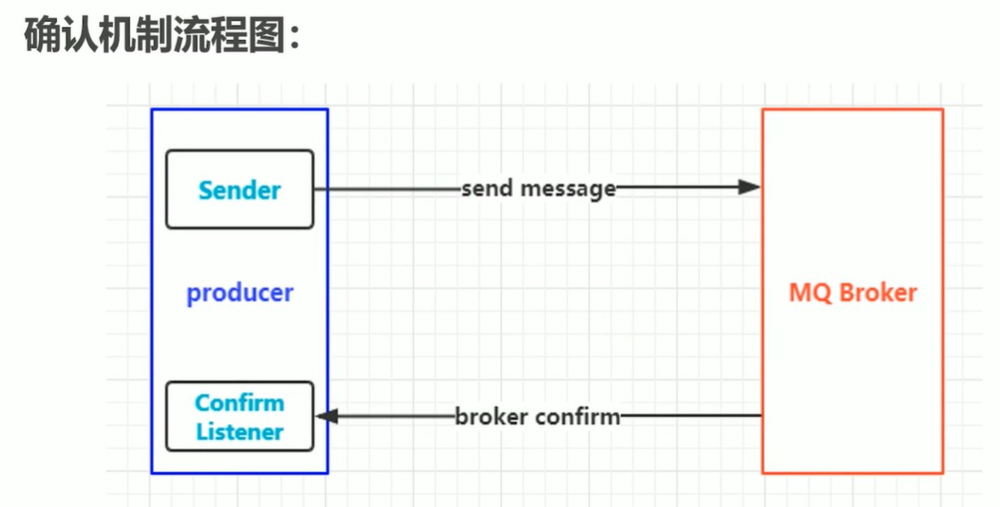

## AMQP

### AMQP vs JMS

- jms是java的消息服务，属API规范，有点对点、发布订阅两种模式，支持TextMessage、MapMessage 等复杂的消息正文格式(5种)。

- AMQP是高级消息队列协议，提供5种消息模型(direct/fanout/topic/headers/system)，仅支持byte[]类型信息，几种消息队列都是基于AMQP来实现的。

### 协议模型


### 核心概念

1. server：又称broker，接受客户端的连接，实现AMQP实体服务。
2. connection：连接，应用程序与broker的连接。
3. Channel：网络信道，几乎所有的操作都在channel中进行，channel是进行消息读写的通道。客户端可建立多个channel，每个channel代表一个会话任务。
4. message：服务器与应用程序之间传送的数据，由properties和body组成，properties可对消息进行修饰，比如消息的优先级，延迟等特性；body就是消息体内容。
5. virtual host：虚拟主机，用于进行逻辑隔离，最上层的消息路由。一个virtual host里面可以有若干个exchange 和 queue，同一个virtual host里面不能有相同名称的exchange和queue。
6. exchange：交换机，接收消息，根据路由键转发消息到绑定的队列。
7. banding：exchange和queue之间的虚拟连接，banding中可以包含routing key。
8. routing key：虚拟机可用它来确定如何路由一个特定消息。
9. queue：也称为message queue，保存消息并将它们转发。

### activemq vs rabbitmq vs rocketmq vs kafka

mq性能衡量指标：服务性能、数据存储、集群架构。

#### activemq

​		apache出品，完全支持JMS规范，功能完善，但性能比其他mq差，高并发场景不能用。

#### kafka

​		apache顶级项目，基于pull模式来处理消息，追求高吞吐量，性能非常好，对消息重复、丢失、错误没有严格要求。如果要求消息的可靠性投递，就不能选择kafka。

#### rocketmq

​		阿里开源的项目，已经孵化为apache的顶级项目，纯Java开发，能支持分布式事务、性能好、也满足可靠性、支持水平扩展、亿级别消息堆积，但商业版收费。

#### rabbitmq

​		基于erlang语言开发，基于AMQP协议实现，可靠性好，稳定性好，性能次于kafka，但高出activemq很多，可用性高。

​		RabbitMQ基于信道channel传输，没有用tcp连接来进行数据传输，tcp链接创建和销毁对于系统性能的开销比较大消费者链接RabbitMQ其实就是一个TCP链接，一旦链接创建成功之后，    就会基于链接创建Channel，每个线程把持一个Channel,Channel复用TCP链接，减少了系统创建和销毁链接的消耗，提高了性能 

- 吞吐量：activeMQ、rabbitMQ比rocketMQ、kafka低  
- 时效性：RabbitMQ基于erlang开发，并发能力强，延时很低，达到微秒级，其他三个都是 ms 级。
- 可用性：activeMQ、rabbitMQ基于主从架构实现高可用，rocketMQ、kafka基于分布式架构实现高可用
- 性能：rabbitmq采用erlang语言开发，使得rabbitmq在broker之间进行数据交互性能非常优秀。erlang有着和原生socket一样的延迟


## rabbitmq

### 安装与使用

###  安装

```shell
# 准备
yum install build-essential openssl openssl-devel unixODBC unixODBC-devel make gcc gcc-c++ kernel-devel m4 ncurses-devel tk tc xz

# 下载安装包
wget www.rabbitmq.com/releases/erlang/erlang-18.3-1.el7.centos.x86_64.rpm
wget http://repo.iotti.biz/CentOS/7/x86_64/socat-1.7.3.2-5.el7.lux.x86_64.rpm
wget www.rabbitmq.com/releases/rabbitmq-server/v3.6.5/rabbitmq-server-3.6.5-1.noarch.rpm

#安装
rpm -ivh erlang-18.3-1.el7.centos.x86_64.rpm
rpm -ivh socat-1.7.3.2-5.el7.lux.x86_64.rpm
rpm -ivh rabbitmq-server-3.6.5-1.noarch.rpm 
```

### 启动

```shell
# 设置开启启动
chkconfig rabbitmq-server on
 
# 启动服务
service rabbitmq-server start
# 或
rabbitmq-server start & 
# rabbitmq-server start & 如果显示正在运行可以用ps -ef|grep rabbit查出正在运行的端口号并 kill 端口号
# rabbitmq-server start & 如果运行成功，会提示log文件位置：/var/log/rabbitmq/rabbit@【主机名】-c49b.log(主机名配置文件：/etc/hostname)
# 验证是否启动： lsof -i:5672 

# 停止服务
service rabbitmq-server stop
# 或
rabbitmqctl stop_app
```

### 配置

```shell
# 开启插件
rabbitmq-plugins enable rabbitmq_management

# 开放端口
firewall-cmd --add-port=5672/tcp --permanent
firewall-cmd --add-port=15672/tcp --permanent
firewall-cmd --reload

# 启动rabbitmq后，在/var/log/rabbitmq目录下会有日志文件，在rabbit@ecs-c49b.log文件的最上方，可以看# 到一个 config file(s) 指定了配置文件位置，
# /usr/share/doc/rabbitmq-server-3.7.7/rabbitmq.config.example 是一个配置文件的模板。

#/usr/lib/rabbitmq/lib/rabbitmq_server-3.6.5/ebin/rabbit.app 是核心配置文件
# 修改rabbit.app 42行，改为  {loopback_users, [guest]},  即可。
```

### 命令行使用


### 架构图


## exchange

### 架构图

接收消息，并根据路由键转发消息到队列。


### 属性

	1. name
 	2. type：交换机类型，direct、topic、fanout、headers。
 	3. durability：是否需要持久化。
 	4. auto delete：当最后一个绑定到exchange上的队列删除后，自动删除该exchange。
 	5. internal：当前exchange是否用于rabbitmq内部使用，默认false
 	6. arguments：扩展参数，用于扩展amqp协议自定制化使用。

### Direct Exchange

​		所有发送到Direct Exchange的消息被转发到RouteKey中指定的Queue。**即RouteKey必须一样才能正常接收。  **

​		注意：Direct模式可以使用rabbitmq自带的exchange：default exchange，所以不需要将exchange进行任何绑定操作，消息传递时，RouteKey必须完全匹配才会被队列接收，否则该消息会被抛弃。


### Topic Exchange

​		所有发送到Topic Exchange的消息被转发到所有关心RouteKey中指定Topic的Queue上。  

​		exchange将RouteKey和某个Topic进行模糊匹配，此时队列需要绑定一个Topic。**即RouteKey可以不完全一样，只需匹配成功就能正常接收**

​		模糊匹配：`#`匹配一个或多个词，`*`匹配不多不少一个词。


### Fanout Exchange

​		不处理路由键，只需要简单的将队列绑定到交换机上。

​		发送到交换机的消息都会被转发到与该交换机绑定的队列上。

​		Fanout交换机转发消息是最快的。

​		**即主要exchange和queue有绑定关系就可以正常接收，与RouteKey无关**


## Binding

​		exchange和exchange、queue之间的连接关系。

​		Binding中可以包含RoutingKey或者参数

## Queue

​		消息队列，实际存储数据。

​		Durability：是否持久化。

​		Atuo delete：如果为yes，表示当最后一个监听被移除之后，该Queue会被自动删除。

## Message

​		服务器和应用程序之间传送的数据。

​		本质上就是一段数据，由Properties和Payload(Body)组成。

​		常用属性：**delivery mode(设为2表示持久化消息)、headers(指定map类型的自定义属性)**

​		其他属性：content_type、content_encoding、priority、correlation_id(唯一ID)、reply_to、expiration(过期时间)、message_id、timestamp、type、user_id ...

## Virtual host

​		虚拟地址，用于进行逻辑隔离，最上层的消息路由。

​		一个Virtual host里面可以有若干个exchange 和 queue。

​		同一个virtual host里面不能有相同名称的exchange或queue。

## 如何保障消息100%投递成功


​		这种方案需要进行两次数据库操作，一次存业务，一次存消息，在高并发场景下数据库可能会遇到瓶颈，

下面这种方案根据消息的延迟投递，做二次确认，回调检查，目的是减少数据库操作：


​	

## 海量订单产生的业务高峰期，如何避免重复消费

### 唯一ID + 指纹码机制，利用数据库主键去重

​		唯一ID + 指纹码保证了主键是唯一的，比如插入数据时先查询

​			`select count(1) from t_order where id = 唯一ID + 指纹`。

​		好处：实现简单。

​		坏处：高并发下有数据库写入瓶颈。

​		解决方案：根据ID进行分库分表。

### 利用Redis原子性实现

问题：

	1.redis中数据是否进行落库，如果落库，落库过程如何做到原子性。
  		2. 如果不落库，都存到缓存中，如何设置定时同步策略

## Confirm确认消息

​		指broker收到消息后，给生产者一个应答。

​		生产者进行接收应答，用来确定这条消息是否正常发送到broker，这种方式是消息可靠传递的核心保障。



实现方式：


1. 在生产者channel上开启确认模式：`channel.confirmelect`
2. 在生产者channel上添加confirm 监听：`channel.addConfirmListener`

##  Return返回消息

​		return listener用于处理一些不可路由的消息，消息生产者通过指定一个exchange和RoutingKey把消息送达到某个队列中去，然后消费者监听队列，进行消费处理操作，但在某些情况下，发送消息时，当前的exchange不存在或者指定的RoutingKey路由不到，这时需要监听这种不可达的消息就要使用Return Listener。

​		基础API中有一个关键配置项：`mandatory`，如果true，则监听器会接收路由不可达的消息。


实现方式：

1.生产者channel上添加return监听： `channel.addReturnListener`

2.生产者channel的`basicPublish`中设置`mandatory`为true

## 消费端限流

​		rabbitmq提供了一种qos(服务质量保证)功能，即在非自动确认消息的前提下，如果一定数目的消息(通过基于consume或者channel设置qos的值)未被确认前，不消费新的消息。