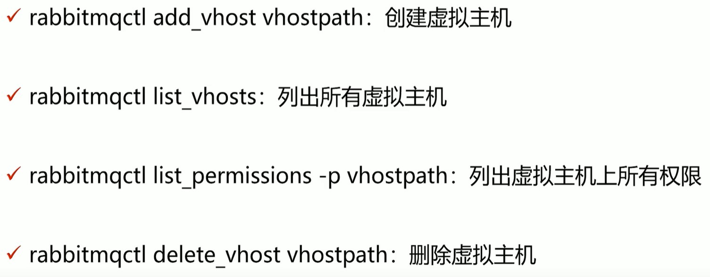
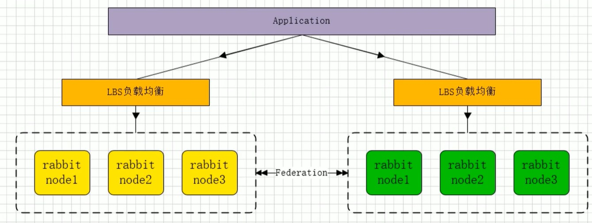

## AMQP

### AMQP vs JMS

- jms是java的消息服务，属API规范，类似JDBC。jms有点对点、发布订阅两种模式，支持TextMessage、MapMessage 等复杂的消息正文格式(5种)。

- AMQP是高级消息队列协议，提供5种消息模型(direct/fanout/topic/headers/system)，仅支持byte[]类型信息，几种消息队列都是基于AMQP来实现的。

### 协议模型


### 核心概念

1. server：又称broker，接受客户端的连接，实现AMQP实体服务。
2. connection：连接，应用程序与broker的连接。
3. Channel：网络信道，几乎所有的操作都在channel中进行，channel是进行消息读写的通道。客户端可建立多个channel，每个channel代表一个会话任务。
4. message：服务器与应用程序之间传送的数据，由properties和body组成，properties可对消息进行修饰，比如消息的优先级，延迟等特性；body就是消息体内容。
5. virtual host：虚拟主机，用于进行逻辑隔离，最上层的消息路由。一个virtual host里面可以有若干个exchange 和 queue，同一个virtual host里面不能有相同名称的exchange和queue。
6. exchange：交换机，接收消息，根据路由键转发消息到绑定的队列。
7. banding：exchange和queue之间的虚拟连接，banding中可以包含routing key。
8. routing key：虚拟机可用它来确定如何路由一个特定消息。
9. queue：也称为message queue，保存消息并将它们转发。

### activemq vs rabbitmq vs rocketmq vs kafka

mq性能衡量指标：服务性能、数据存储、集群架构。

#### activemq

​		apache出品，完全支持JMS规范，功能完善，但性能比其他mq差，高并发场景不能用。

#### kafka

​		apache顶级项目，基于pull模式来处理消息，追求高吞吐量，性能非常好，对消息重复、丢失、错误没有严格要求。如果要求消息的可靠性投递，就不能选择kafka。在**大数据领域**的**实时计算**以及**日志采集**被大规模使用。

#### rocketmq

​		阿里开源的项目，已经孵化为apache的顶级项目，纯Java开发，能支持分布式事务、性能好、也满足可靠性、支持水平扩展、亿级别消息堆积，但商业版收费。

#### rabbitmq

​		基于erlang语言开发，基于AMQP协议实现，可靠性好，稳定性好，性能次于kafka，但高出activemq很多，可用性高。

​		RabbitMQ基于信道channel传输，没有用tcp连接来进行数据传输，tcp链接创建和销毁对于系统性能的开销比较大消费者链接RabbitMQ其实就是一个TCP链接，一旦链接创建成功之后，    就会基于链接创建Channel，每个线程把持一个Channel,Channel复用TCP链接，减少了系统创建和销毁链接的消耗，提高了性能 

- 吞吐量：**activeMQ、rabbitMQ为万级，比rocketMQ、kafka十万级低**  
- 时效性：RabbitMQ**基于erlang开发**，并发能力强，**延时很低，达到微秒级，其他三个都是 ms 级**。
- 可用性：activeMQ、rabbitMQ基于主从架构实现高可用，rocketMQ、kafka基于分布式架构实现高可用
- 性能：rabbitmq采用erlang语言开发，使得rabbitmq在broker之间进行数据交互性能非常优秀。erlang有着和原生socket一样的延迟

## rabbitmq

### 安装与使用

###  安装

```shell
# 准备
yum install build-essential openssl openssl-devel unixODBC unixODBC-devel make gcc gcc-c++ kernel-devel m4 ncurses-devel tk tc xz

# 下载安装包
wget www.rabbitmq.com/releases/erlang/erlang-18.3-1.el7.centos.x86_64.rpm
wget http://repo.iotti.biz/CentOS/7/x86_64/socat-1.7.3.2-5.el7.lux.x86_64.rpm
wget www.rabbitmq.com/releases/rabbitmq-server/v3.6.5/rabbitmq-server-3.6.5-1.noarch.rpm

#安装
rpm -ivh erlang-18.3-1.el7.centos.x86_64.rpm
rpm -ivh socat-1.7.3.2-5.el7.lux.x86_64.rpm
rpm -ivh rabbitmq-server-3.6.5-1.noarch.rpm 
```

### 启动

```shell
# 设置开启启动
chkconfig rabbitmq-server on
 
# 启动服务
service rabbitmq-server start
# 或
rabbitmq-server start & 
# rabbitmq-server start & 如果显示正在运行可以用ps -ef|grep rabbit查出正在运行的端口号并 kill 端口号
# rabbitmq-server start & 如果运行成功，会提示log文件位置：/var/log/rabbitmq/rabbit@【主机名】-c49b.log(主机名配置文件：/etc/hostname)
# 验证是否启动： lsof -i:5672 

# 停止服务
service rabbitmq-server stop
# 或
rabbitmqctl stop_app
```

### 配置

```shell
# 开启插件
rabbitmq-plugins enable rabbitmq_management

# 开放端口
firewall-cmd --add-port=5672/tcp --permanent
firewall-cmd --add-port=15672/tcp --permanent
firewall-cmd --reload

# 启动rabbitmq后，在/var/log/rabbitmq目录下会有日志文件，在rabbit@ecs-c49b.log文件的最上方，可以看# 到一个 config file(s) 指定了配置文件位置，
# /usr/share/doc/rabbitmq-server-3.7.7/rabbitmq.config.example 是一个配置文件的模板。

#/usr/lib/rabbitmq/lib/rabbitmq_server-3.6.5/ebin/rabbit.app 是核心配置文件
# 修改rabbit.app 42行，改为  {loopback_users, [guest]},  即可。
```

### 命令行使用





### 架构图


## exchange

### 架构图

接收消息，并根据路由键转发消息到队列。


### 属性

	1. name
 	2. type：交换机类型，direct、topic、fanout、headers。
 	3. durability：是否需要持久化。
 	4. auto delete：当最后一个绑定到exchange上的队列删除后，自动删除该exchange。
 	5. internal：当前exchange是否用于rabbitmq内部使用，默认false
 	6. arguments：扩展参数，用于扩展amqp协议自定制化使用。

### Direct Exchange

​		所有发送到Direct Exchange的消息被转发到RouteKey中指定的Queue。**即RouteKey必须一样才能正常接收。  **

​		注意：Direct模式可以使用rabbitmq自带的exchange：default exchange，所以不需要将exchange进行任何绑定操作，消息传递时，RouteKey必须完全匹配才会被队列接收，否则该消息会被抛弃。


### Topic Exchange

​		所有发送到Topic Exchange的消息被转发到所有关心RouteKey中指定Topic的Queue上。  

​		exchange将RouteKey和某个Topic进行模糊匹配，此时队列需要绑定一个Topic。**即RouteKey可以不完全一样，只需匹配成功就能正常接收**

​		模糊匹配：`#`匹配一个或多个词，`*`匹配不多不少一个词。


### Fanout Exchange

​		不处理路由键，只需要简单的将队列绑定到交换机上。

​		发送到交换机的消息都会被转发到与该交换机绑定的队列上。

​		Fanout交换机转发消息是最快的。

​		**即主要exchange和queue有绑定关系就可以正常接收，与RouteKey无关**


## Binding

​		exchange和exchange、queue之间的连接关系。

​		Binding中可以包含RoutingKey或者参数

## Queue

​		消息队列，实际存储数据。

​		Durability：是否持久化。

​		Atuo delete：如果为yes，表示当最后一个监听被移除之后，该Queue会被自动删除。

## Message

​		服务器和应用程序之间传送的数据。

​		本质上就是一段数据，由Properties和Payload(Body)组成。

​		常用属性：**delivery mode(设为2表示持久化消息)、headers(指定map类型的自定义属性)**

​		其他属性：content_type、content_encoding、priority、correlation_id(唯一ID)、reply_to、expiration(过期时间)、message_id、timestamp、type、user_id ...

## Virtual host

​		虚拟地址，用于进行逻辑隔离，最上层的消息路由。

​		一个Virtual host里面可以有若干个exchange 和 queue。

​		同一个virtual host里面不能有相同名称的exchange或queue。

## 如何保障消息100%投递成功


​		这种方案需要进行两次数据库操作，一次存业务，一次存消息，在高并发场景下数据库可能会遇到瓶颈，

下面这种方案根据消息的延迟投递，做二次确认，回调检查，目的是减少数据库操作：


​	

## 海量订单产生的业务高峰期，如何避免重复消费

### 唯一ID + 指纹码机制，利用数据库主键去重

​		唯一ID + 指纹码保证了主键是唯一的，比如插入数据时先查询

​			`select count(1) from t_order where id = 唯一ID + 指纹`。

​		好处：实现简单。

​		坏处：高并发下有数据库写入瓶颈。

​		解决方案：根据ID进行分库分表。

### 利用Redis原子性实现

问题：

1.redis中数据是否进行落库，如果落库，落库过程如何做到原子性。
2.如果不落库，都存到缓存中，如何设置定时同步策略

## Confirm确认消息

​		指broker收到消息后，给生产者一个应答。

​		生产者进行接收应答，用来确定这条消息是否正常发送到broker，这种方式是消息可靠传递的核心保障。


实现方式：


1. 在生产者channel上开启确认模式：`channel.confirmelect`
2. 在生产者channel上添加confirm 监听：`channel.addConfirmListener`

##  Return返回消息

​		return listener用于处理一些不可路由的消息，消息生产者通过指定一个exchange和RoutingKey把消息送达到某个队列中去，然后消费者监听队列，进行消费处理操作，但在某些情况下，发送消息时，当前的exchange不存在或者指定的RoutingKey路由不到，这时需要监听这种不可达的消息就要使用Return Listener。

​		基础API中有一个关键配置项：`mandatory`，如果true，则监听器会接收路由不可达的消息。


实现方式：

1.生产者channel上添加return监听： `channel.addReturnListener`

2.生产者channel的`basicPublish`中设置`mandatory`为true

## 消费端限流

​		rabbitmq提供了一种qos(服务质量保证)功能，即在非自动确认消息的前提下，如果一定数目的消息(通过基于consume或者channel设置qos的值)未被确认前，不消费新的消息。

​		使用限流不能设置自动签收，

- `channel.basicConsume`中`autoAck`要设为`false`，

- 消费端`channel.basicQos(int prefetchSize, int prefetchCount, boolean global)`中，

  - `prefetchSize`：0

  - `prefetchCount`：告诉rabbitMQ不要一次推送多余N个消息，如果有N个消息没有ack，consumer将block掉，直到有消息ack。

  - `global`：是否将上面的设置应用于channel，即这个限制是channel级别还是consumer级别。

  - `prefetchSize`、`global`这两项rabbitmq中还没有实现，暂不研究，`prefetchCount`必须在`autoAck`为`false`时才会生效。

## TTL 

- ttl是time to live的缩写，也就是生存时间。

- rabbitmq支持消息的过期时间，在消息发送时进行执行。

- rabbitmq支持队列的过期时间，从消息入队开始计算，只要超时，消息就会被清除。

## 死信队列

- 死信队列：DLX （Dead Letter Exchange）

- 利用DLX，当消息在一个队列中变成死信之后，它能被重新publish到另一个exchange，这个exchange就是DLX。

- 消息变为死信有以下几种请求：

  - 消息被拒绝：`basic.reject`/`basic.nack`并且`requeue=false`

  - 消息TTL过期

  - 队列到达最大长度

- DLX也是一个正常的exchange，和一般的exchange没有区别，它能在任何的队列上被指定，实际上就是设置某个队列的属性。

- 当这个队列中有死信时，rabbitmq就会自动的将这个消息重新发布到设置的exchange上去，进而被路由到另一个队列。

- 实现：

   1. 设置死信队列的`exchange`和`queue`：

       	1. Exchange：`dlx.exchange`
       	2. Rueue：`dlx.queue`
       	3. RoutingKey：`#`

      2.正常声明交换机、队列、绑定，并在队列上加一个参数：

      ​	`arguments.put("x-dead-letter-exchange","dlx.exchange");`

## 单元化架构设计衍变之路

​		单个大型分布式体系的集群，通过加机器+集群内部分拆，虽然具备了一定的扩展性，但是，随着业务量的进一步增长，整个集群规模逐渐变得巨大，从而一定会在某个点上到达瓶颈，无法满足扩展性需要，并且大集群内核心服务出现问题，会影响全网所有用户。

  		1. 容灾问题
         		1. 核心服务挂掉，会影响全网用户，导致整个业务不可用
  		2. 资源扩展问题
         		1. 单IDC的资源已经没法满足，扩展IDC时，存在跨机房访问时延问题
  		3. 集群拆分问题
         		1. 分布式菌群规模扩大后，会相应的带来资源扩展、大集群拆分、容灾问题。

解决方法：**单元化架构**

- 同城“双活”架构：

  - 业务层面已经做到真正的“双活”(或者“多活”)，分别承担部分流量。

  - 存储方面比如定时任务、缓存、持久层、数据分析等都是主从架构，会有跨机房写。

  - 一个数据中心故障，可以手动切换流量，部分组件可以自动切换。

- 两地三中心架构：

  - 使用灾备的思想，在同城“双活”的基础上，在异地部署一套灾备数据中心，每个中心都具有完备的数据处理能力，只有当主节点故障需要容灾时才会紧急启动备用数据中心。


- SET话方案目标：
  - 业务：解决业务遇到扩展性和容灾等需求，支撑业务的高速发展。
  - 通用性：架构侧形成统一通用的解决方案，方便各业务线接入使用。

## SET化架构策略

架构图：


- 流量路由
  - 按照特殊的key(通常为userid)进行路由，判断某次请求该路由到中心集群还是单元化集群。
- 中心集群
  - 未进行单元化改造的服务(通常不在核心交易链路，比如供应链系统)成为中心集群，跟当前架构保持一致。
- 单元化集群
  - 每个单元化集群只负责本单元内的流量处理，以实现流量拆分及故障隔离。
  - 每个单元化集群前期只存储本单元产生的交易数据，后续会做双向数据同步，以实现容灾切换需求。
- 中间件
  - RPC：对于SET服务，调用封闭在SET内，对于非SET服务，用现有路由逻辑。
  - KV：支持分SET的数据产生和查询。
  - MQ：支持分SET的消息生产和消费。

- 数据同步
  - 全局数据(数据量小且变化不大，比如商家菜品数据)部署在中心集群，其他单元化集群同步全局数据到本单元化内。
  - 未来衍变为异地“多活”架构时，各单元化集群数据需要进行双向同步来实现容灾需要。

### SET化路由策略及其能力

- 异地容灾
  - 通过SET化架构的流量调度能力，将SET分别部署在不同地区的数据中心，实现跨地区容灾支持。
- 高效本地化服务
  - 利用前端位置信息采集和域名解析策略，将流量路由到最近的SET，提供最高效的本地化服务。
  - 比如O2O场景天然具有本地生产，本地消费的特点，更加需要SET化支持。
- 集装箱式扩展
  - SET的封装性支持更灵活的部署扩展性，比如SET一键创建/下线，SET一键发布。


### SET化架构原则

- 对业务透明原则
  - SET化架构的实现对业务代码透明，业务代码层面不需要关心SET化规则，SET的部署等问题。
- SET切分规则
  - 理论上，切分规则由业务层面按需定制
  - 实现上，建议优先选最大的业务维度进行切分
- 部署规范原则
  - 一个SET并不一定只限制在一个机房，也可以跨机房或跨地区部署，为保证灵活性，单个SET内机器数不宜过多(比如不超过1000台物理机)

## RabbitMQ-SET化架构实现

SET化消息中间件架构实现(RabbitMQ双活，用`Federation`插件做集群间的通信)：



### `federation`

- 安装

```shell
# 当在一个cluster中使用federation插件，所有在集群中的nodes都需要安装federation插件
rabbitmq-plugins enable rabbitmq_federation
rabbitmq-plugins enbale rabbitmq_federation_management
```

- `federation`插件是一个在不需要cluster，而brokers之间传输消息的高性能插件
- `federation`插件可以在brokers或者cluster之间传输消息，连接的双方可以使用不同的users和virtual hosts，或者双方的rabbitmq和erlang版本不一致，`federation`插件使用AMQP协议通信，可以接受不连续的传输。

## MQ组件实现思路和架构设计方案

## 架构


### MQ组件实现功能点

- 支持消息高性能的序列化转换、异步化发送消息
- 支持消息生产实例与消费实例的连接池化缓存化、提升性能
- 支持可靠性投递消息，保障消息的100%不丢失
- 支持消费端的幂等操作，避免消费端重复消费的问题

- 支持迅速消息发送模式，在一些日志收集/统计分析等需求下可以保证高性能、超高吞吐量。
- 支持延迟消息模式，消息可以延迟发送，指定延迟时间，用于某些延迟检查、服务限流场景
- 支持事务消息，且100%保障可靠性投递，在金融行业单笔大金额操作时会有此类需求

- 支持顺序消息，保证消息送达消费端的前后顺序，例如下单等复合性操作
- 支持消息补偿，重试以及快速定位异常/失败消息
- 支持集群消息负载均衡，保障消息落到具体SET集群的负载均衡
- 支持消息路由策略，指定某些消息路由到指定的SET集群

### 迅速消息发送

- 指消息不进行落库存储，不做可靠性保障
- 在一些非核心消息、日志数据、统计分析等场景下比较适合
- 迅速消息的优点是性能高、吞吐最大


### 确认消息发送


### 批量消息发送

- 批量消息是指我们把消息放到一个集合里统一进行提交，这种方案设计思路是是期望消息在一个会话里，比如投掷到threadlocal里的集合，然后拥有相同的会话ID，并且带有这次提交消息的size等相关属性，最重要的一点是要把这一批消息进行合并。对于channel而言，就是发送一次消息，这种方式也是希望消费端在消费时，可以进行批量化的消费，针对于某一原子业务的操作去处理，但不保障可靠性，需要进行补偿机制。


### 延迟消息发送

- 在Message封装时添加`delayTime`属性即可，使得我们的消息可以进行延迟发送。

- 场景：电商平台买到的商品签收后，如果不确认支付，那么系统自动会在7天后进行支付；再比如红包、优惠券的使用期限。

### 顺序消息发送

1. 发送的顺序消息，必须保障消息投递到同一个队列，且这个消费者只能有一个(独占模式)
2. 然后需要统一提交，所有消息的会话ID一致
3. 添加消息属性：顺序标记的序号、本次顺序消息的size属性，进行落库操作
4. 并行进行发送给自身的延迟消息进行后续消费处理
5. 当收到延迟消息后，会根据会话ID、size抽取数据库数据进行处理即可
6. 定时轮询补偿机制，对于异常请求做处理


### 事务消息发送

- 为了保障性能的同时，也支持事务，并不选择传统的rabbitmq和spring集成的机制。

- 解决方案：
  - 采用类似可靠性投递的机制，也就是补偿机制
  - 我们的数据源必须是同一个，也就是业务操作DB1数据库和消息记录DB2数据库使用同一个数据源
  - 然后利用重写`Spring DataSourceTransactionManager`，在本地事务提交的时候进行发送消息，但是也有可能事务提交成功但消息发送失败，这个时候就要进行补偿了。


### 幂等性的必要性

- 可能导致消息出现非幂等的原因
  - 可靠性消息投递机制
    - 比如消息发过去，mq收到了，但mq在返回confirm时突然出现闪断，生产端没有收到返回的ack，定时任务轮询时可能就导致消息发送了两次。
  - MQ broker服务与消费端传输消息的过程中的网络抖动
  - 消费端故障或异常
- 幂等性设计

